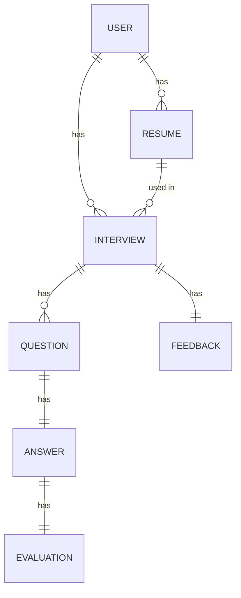

# Database ER Diagram

> Fill in with an actual diagram (e.g. dbdiagram.io, drawio, or a Mermaid ER diagram) once models stabilize.

## Tables (from SRS)

- **User**: id, full_name, email, hashed_password, created_at
- **Resume**: id, user_id (FK), file_url, raw_text, skills, education, experience, projects, uploaded_at
- **Interview**: id, user_id (FK), resume_id (FK), interview_type, difficulty, num_questions, status, overall_score, created_at, completed_at
- **Question**: id, interview_id (FK), order_index, text
- **Answer**: id, question_id (FK), text, answered_at
- **Evaluation**: id, answer_id (FK), technical_score, communication_score, completeness_score, confidence_score, missing_concepts, better_answer, learning_resources
- **Feedback**: id, interview_id (FK, unique), overall_score, strengths, weaknesses, improvement_areas, topics_to_study, report_pdf_url

## Relationships
- User 1---N Resume
- User 1---N Interview
- Resume 1---N Interview (optional FK)
- Interview 1---N Question
- Question 1---1 Answer
- Answer 1---1 Evaluation
- Interview 1---1 Feedback

