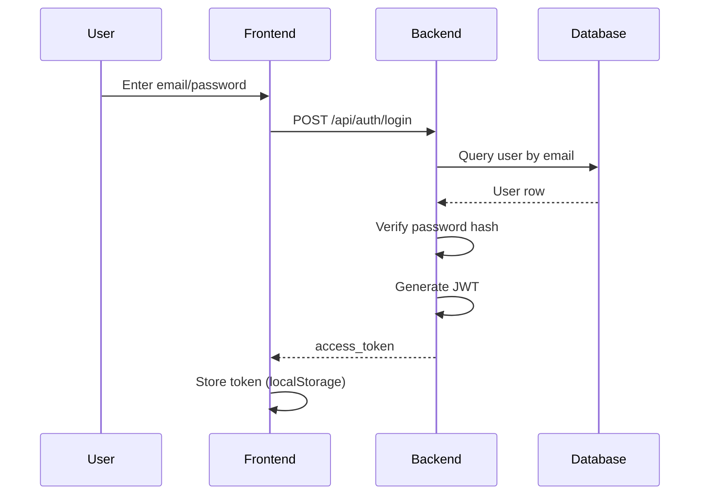
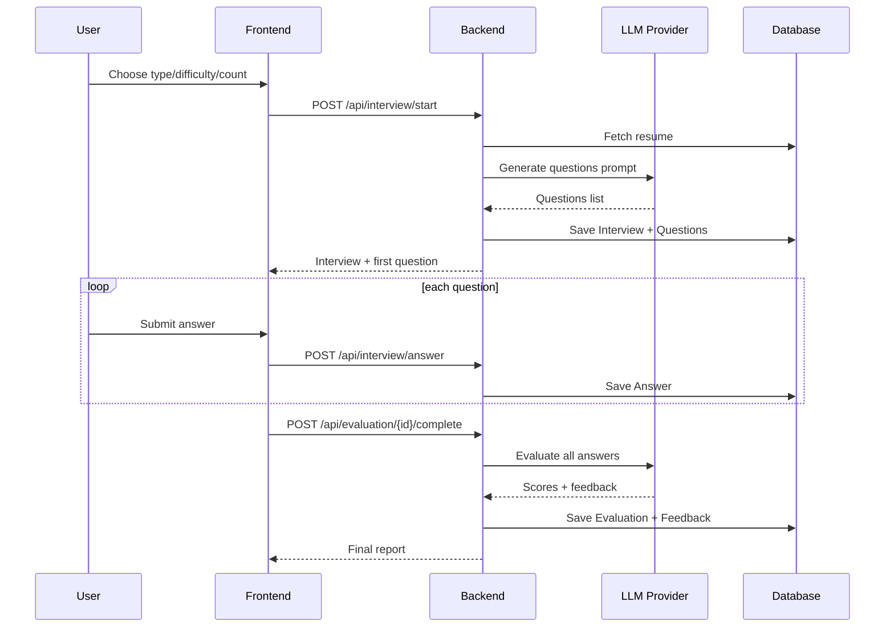

# Sequence Diagrams

## Login flow

```mermaid
sequenceDiagram
    participant U as User
    participant F as Frontend
    participant B as Backend
    participant DB as Database

    U->>F: Enter email/password
    F->>B: POST /api/auth/login
    B->>DB: Query user by email
    DB-->>B: User row
    B->>B: Verify password hash
    B->>B: Generate JWT
    B-->>F: access_token
    F->>F: Store token (localStorage)
```

## Interview session flow

```mermaid
sequenceDiagram
    participant U as User
    participant F as Frontend
    participant B as Backend
    participant AI as LLM Provider
    participant DB as Database

    U->>F: Choose type/difficulty/count
    F->>B: POST /api/interview/start
    B->>DB: Fetch resume
    B->>AI: Generate questions prompt
    AI-->>B: Questions list
    B->>DB: Save Interview + Questions
    B-->>F: Interview + first question

    loop each question
        U->>F: Submit answer
        F->>B: POST /api/interview/answer
        B->>DB: Save Answer
    end

    F->>B: POST /api/evaluation/{id}/complete
    B->>AI: Evaluate all answers
    AI-->>B: Scores + feedback
    B->>DB: Save Evaluation + Feedback
    B-->>F: Final report
```
